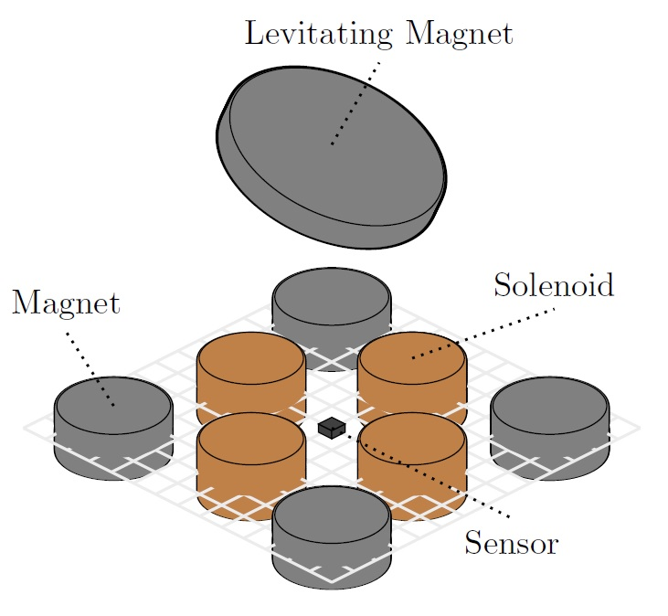

# Take-home Maglev lab \:magnet\:

<table style="width: 100%; text-align: center;">
  <tr>
    <td style="vertical-align: middle; text-align: center;">
      
       
      1) Version 2.6 of the lab.
    </td>
    <td style="vertical-align: middle; text-align: center;">
      
       
      2) Illustration of the system.
    </td>
  </tr>
</table>

The "Take-home Maglev lab" is a small lab in development at the Norwegian University of Science and Technology (NTNU) tailored to students in control and related fields. It is intended as a kit that students can bring home and assemble independently, with additional lab assignments for teaching anything from fundamental to advanced concepts within control engineering.

See [the wiki](https://www.ntnu.no/wiki/x/OYSyEw) for more information on the project.

This repository contains a
- **[MATLAB simulator](./simulation):** Implementation of several models with examples, see [main.mlx](./simulation/main.mlx) for how to use it.
- **[Design files & software](./physical_system):** PCB files, test code, and example usage for the physical system.
- **[Student contributions](./student_contributions):** Code and project reports from student projects.

Following is information on student reports and hardware development history.
## Project reports \:books\:
### 2022
 1. [M. Brønstad, J. O. Deila, J. Dyerskog, and M. Langklopp, "Magnetic levitation system: Design, prototyping and testing of a digital PID-controller", B.S. thesis, ITK, NTNU, Trondheim, 2022.](./student_contributions/literature/2022_NTNU_bachelor_thesis_MJJM.pdf)
 2. [A. Morselli, "Re-design of a magnetic levitation platform: from an early prototype to a working system", B.S. thesis, DDD, UNIPD, Padova, 2022.](./student_contributions/literature/2022_UNIPD_bachelor_thesis_alberto_morselli.pdf)
 3. [A. Nicetto, "State Space Observers and Controllers for a Take-Home Magnetic Levitation System", B.S. thesis, DDD, UNIPD, Padova, 2022.](./student_contributions/literature/2022_UNIPD_bachelor_thesis_andrea_nicetto.pdf)
 4. [F. D. Marchi, "Modeling and Control of a Magnetic Levitation System", B.S. thesis, DDD, UNIPD, Padova, 2022.](./student_contributions/literature/2022_UNIPD_bachelor_thesis_francesco_de_marchi.pdf)
### 2023
1. [H. A. Engmark, K. T. Hoang, "Modeling and Control of a Magnetic Levitation Platform.", presented at the 22nd IFAC World Congress, Yokohama, 2023 pp. 7276-7281. ](./media/literature/maglev_model_description.pdf)
2. [A. Lincetto, "Towards a Pythonic framework for control and analysis of magnetic levitation systems", B.S. thesis, DDD, UNIPD, Padova, 2023.](./student_contributions/literature/2023_UNIPD_bachelor_thesis_alessandro_lincetto.pdf)
3. [G. Piccolin, "considerations on the software and hardware requirements for the implementation of take-home Maglev control labs", B.S. thesis, DDD, UNIPD, Padova, 2023.](./student_contributions/literature/2023_UNIPD_bachelor_thesis_giulio_piccolin.pdf)
4. [S. Graffer, "State estimation of a Maglev system with the Luenberger observer", Project thesis, ITK, NTNU, Trondheim, 2023.](./student_contributions/literature/2023_NTNU_project_thesis_sverre_graffer.pdf)
5. [P. I. D. K. Fosmo, "Control of a magnetic levitation system using feedback linearization", Project thesis, ITK, NTNU, Trondheim, 2023.](./student_contributions/literature/2023_NTNU_project_thesis_pål_fosmo.pdf)
6. [S. A. Senkaya, "A take home portable MagLev lab for learning electronics and control", Project thesis, ITK, NTNU, Trondheim, 2023.](./student_contributions/literature/2023_NTNU_project_thesis_sacit_ali_senkaya.pdf)
### 2024
1. [P. I. D. K. Fosmo, S. A. Senkaya, S. Graffer, H. A. Engmark, D. Varagnolo, "Maggy: Hands-on control learning with a maglev system", M.S. thesis, ITK, NTNU, Trondheim, 2024.](https://bth.diva-portal.org/smash/get/diva2:1918096/FULLTEXT01.pdf)
2. [P. I. D. K. Fosmo, H. A. Engmark, D. Varagnolo, "Maglev Systems for Control Education", Maglev24, Malmö, 2024.](https://ntnuopen.ntnu.no/ntnu-xmlui/handle/11250/3153592)
## Version history \:rocket\:
| **Version** | **Developer**                                                  | **Goal**                                                      | **Development period** |      **Status**      | **Result**                  |
| ----------- | -------------------------------------------------------------- | ------------------------------------------------------------- | ---------------------- | :------------------: | --------------------------- |
| V1.0        | M. Brønstad   J. O. Deila   J. Dyrskog   M. Langklopp | Leviation                                                     | Spring 2022            | \:white_check_mark\: | Stable levitation ~ 2 min   |
| V2.0        | M. Brønstad   J. O. Deila   J. Dyrskog                   | Smaller form factor, more robust                              | Summer 2022            | \:white_check_mark\: | Stable levitation >> 2 min  |
| V2.5        | JH Technical AS                                                | Fix minor bugs, improve heating and components                | Spring 2024            | \:white_check_mark\: | Stable levitation >> 2 min  |
| V2.6        | A. Morselli                                                    | Fix faulty wiring, changing sensors                           | Spring 2024            | \:white_check_mark\: | Stable levitation >> 30 min |
| V2.7        | A. Morselli                                                    | Modular design and testbench for V3.0                         | Spring 2024            | \:white_check_mark\: | Decisions on design         |
| V3.0        | A. Morselli                                                    | Modular redesign for first 'Take-home lab'                    | Summer 2024            | \:white_check_mark\: | Decisions on design         |
| V3.1        | M. Leroux                                                      | Adding USB-C power                                            | Fall 2024              | \:white_check_mark\: | Improved power delivery     |
| V4.0        | M. Leroux                                                      | New form factor and additional sensing for improved stability | Fall 2024              | \:white_check_mark\: | Improved control            |
