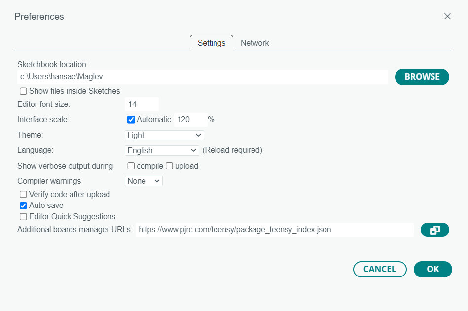
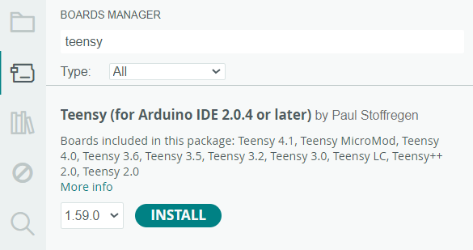
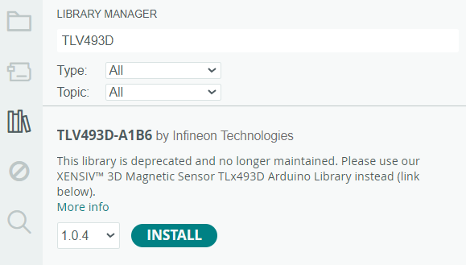
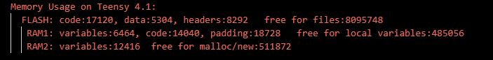

 Here you find:
- **Hardware:** Blueprints for circuit designs of every version of Maggy, components lists and vector files for protective covers/boxes, as well as test-code for checking if the assembeled hardware works as expected.
- **Software:** Various examples of how to use the different veersions of maggy, e.g., PD control embedded on Teensy, and communication protocols for monitoring and control with a computer.

## Setting up for programming Maggy

Each version of Maggy contains a Teensy 4.1 microcontoller, which handles all of the sensor measuremetns, communication and control. This is easily programmed using the Arduino interface, and most of the scripts above are .ino Arduino. To be able to upload these to the Teensy, the following few steps have to be completed:

1.  Install the latest version of [Arduino IDE](https://www.arduino.cc/en/software).

2. When you launch Arduino IDE, you'll see an empty Arduino sketch. Go to **File >> Preferences** (WINDOWS) or **ARDUINO IDE >> Settings** (MAC), and locate the field labeled **"Additional boards manager URLs"** at the bottom of the window, as shown in Figure 1. Paste the following link into the field:
	- [https://www.pjrc.com/teensy/package_teensy_index.json](https://www.pjrc.com/teensy/package_teensy_index.json)
    Use a comma to separate it if there is already something written in the field.

    <td align="center">
       
      Figure 1: Arduino IDE preferences.
    </td>

---

3. Click on **"Boards Manager"** in the toolbar on the left side of the Arduino IDE home screen. Search for "Teensy" and install the Teensy package by Paul Stoffregen, as shown in Figure 2.

	<td align="center">
	   
	  Figure 2: Arduino IDE boards manager.
	</td>

---

4. Click on **"Library Manager"** on the left toolbar, search for "TLE493D" (V2x) or "TLV493D" (V4x) in the search field, and install the package from "Infineon Technologies", as shown in Figure 3.

	<td align="center">
	   
	  Figure 3: Arduino IDE library manager.
	</td>

---

> **NOTE**: Before powering Maggy, remove the large disk magnet from the system. The scripts we'll run later perform bias-removal routines for measurements, and we don't want to remove the effect of the levitating magnet.

---

5.  Connect Maggy and Teensy to your PC with a micro-USB cable.[1](https://chatgpt.com/c/67e6699f-81f0-8013-9739-4315bfa6288c#user-content-fn-1) Check that you can upload a blank sketch by selecting the COM port of Teensy 4.1 from the **"Select board"** drop-down menu at the top of the window. Click **"Upload"** to compile and upload the sketch to Teensy 4.1. You'll see a lot of red text in the console window during compilation and uploading, but the process is successful if the last lines of text appear as shown in Figure 4.

	<td align="center">
	   
	  Figure 4: Arduino IDE command window message upon successful compilation.
	</td>
## Footnotes

1. If the Teensy isn't recognized by the PC, connect external power to Maggy by plugging in the power cable on the opposite side of the USB port. [↩](https://chatgpt.com/c/67e6699f-81f0-8013-9739-4315bfa6288c#user-content-fnref-1)

